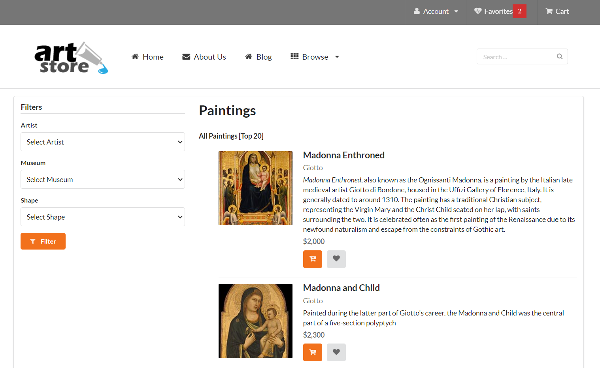

# Art-Web-Store

## SYSC4504 Assignment 3: PHP, SQL, State, Caching

### DESCRIPTION
This simple art store web application uses server-side programming with PHP, SQL, State Management, and Caching.
The web application consists of various main .php files:
* addToFavorites.php
* browse-paintings.php
* remove-favorites.php
* single-painting.php
* view-favorites.php

The web application is supported by various include files in the includes folder:
* art-classes.php
* config.inc.php
* header.inc.php
* sql-database.inc.php

### INSTALLATION
To successfully run the program, the user must have access to XAMPP & Memcached on a Windows/MacOS.
1. Visit the page https://brightspace.carleton.ca/d2l/le/news/65766/54438/view?ou=65766, to run Apache and MySQL database for the program.
2. The user must have the art-small.sql database provided on Brightspace which is imported onto the phpMyAdmin database.
3. The user must be logged in with the correct credentials when creating a User Account.
	- User name (use text field): testuser
	- Host (Local): localhost
	- Password (use text field): mypassword
	- Re-Type: mypassword

### USAGE
1. Move the downloaded file into the directory path: C:\xampp\htdocs for the program to run.
2. After downloading XAMPP successfully onto your computer, open the XAMPP Control Panel.
3. On the XAMPP Control Panel, select the Start buttons for Apache and MySQL modules to run the program.
4. To run the web application, open the preffered web browser (Google Chrome, Microsoft Edge, etc) and type in the search bar: "localhost/Start/browse-paintings.php".
5. A web browser art store will appear onto your browser.

Features of the Web Application:
Users can interact with the web application by clicking parts of the web page that allows users to navigate throughout different web pages.

--------------------
browse-paintings.php
--------------------
* On the left Filters navigation tab, users will be able to filter through a list of Artists, Museums, and Shapes in the drop-downs which are populated from the SQL database provided. When clicking the filter button, the user will be able to view the filtered output list.
* Users will be able to click on the actual painting that is displayed and will direct them to a single-painting.php file based on the Painting ID.

* When the single painting display appears, users may view the title of the painting, artist, overall reviews, details, the museum it is placed in, the genre, the subject, the price and features of the painting.
	- click on the actual painting 
	- add to favorites

### LICENSE
Copyright 2021 Dorothy Tran. All rights reserved.
